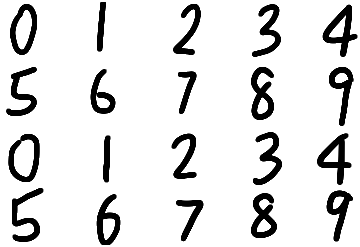
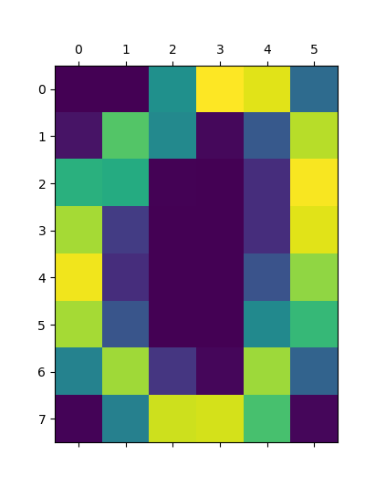

# Description
The tool created in this project identifies the location of diigts (0 - 9) presented in a white backgorund image and judges which digits they are.

1. The program first enhances the objects present in the image by "bolding" the black color characters. It does so with convolutional techniques.

2. Then it applies flood-fill algorithm (Breadth First Search) on the enhanced image to locate all the objects.

3. After locating all digits, the tool creates individual subimages for each one of the digits found in the image and resizes them to fit in a 6-by-8 matrix, which is known as the raw feature matrix containing 6 * 8 = 48 features.

*Here are the typical features for digits 0 through 9*

4. However, for images, using each pixel as one feature may not be a good approcah because there are still a lot of them even after the abstraction done above. Therefore, the program considers to use PCA to reduce the number of dimensions of the feature space while keeping 95% explained features, which also eliminates some noises in the input.

5. After number of features has been reduced to approximately 30, the tool trains a quadratic logistic regression classifier with an accuracy of 98%

6. In the future, operators (+-*/) will be added into the training set so that it will support simple arithmatic calculations.
